# Ledgerium AI — User Guide

> **ledgerium.ai** — Evidence-based workflow intelligence

This guide covers everything you need to get value from Ledgerium AI: recording your first workflow, reading the outputs, understanding the intelligence layer, collaborating with your team, and managing your account.

---

## Table of Contents

1. [Getting Started](#1-getting-started)
2. [Dashboard and Workflow Library](#2-dashboard-and-workflow-library)
3. [Workflow Detail View](#3-workflow-detail-view)
   - [3.1 Process Map (Workflow Tab)](#31-process-map-workflow-tab)
   - [3.2 SOP Tab](#32-sop-tab)
   - [3.3 Report Tab](#33-report-tab)
   - [3.4 Insights Tab](#34-insights-tab)
   - [3.5 Interpretation Tab](#35-interpretation-tab)
   - [3.6 Intelligence Tab](#36-intelligence-tab)
   - [3.7 AI Agents Tab](#37-ai-agents-tab)
   - [3.8 Evidence Tab](#38-evidence-tab)
4. [Process Intelligence (Analytics)](#4-process-intelligence-analytics)
   - [4.1 Process Detail](#41-process-detail)
5. [Recommendations Center](#5-recommendations-center)
6. [Teams and Collaboration](#6-teams-and-collaboration)
7. [Account and Settings](#7-account-and-settings)
8. [Sharing Workflows](#8-sharing-workflows)
9. [Exporting Data](#9-exporting-data)
10. [Plans and Pricing](#10-plans-and-pricing)
11. [Privacy and Security](#11-privacy-and-security)
12. [Troubleshooting and FAQ](#12-troubleshooting-and-faq)

---

## 1. Getting Started

### 1.1 Creating your account

Ledgerium AI is free to start — no credit card required.

1. Go to [ledgerium.ai/signup](https://ledgerium.ai/signup)
2. Enter your name, email address, and a password (minimum 8 characters)
3. Click **Create Account**
4. You are signed in and taken to your dashboard

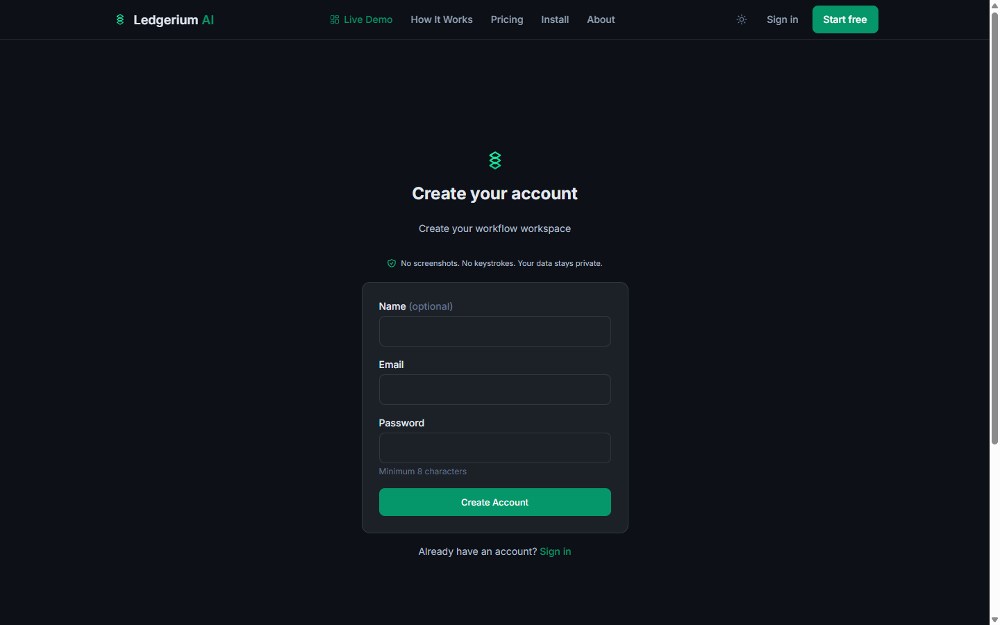

> **Tip:** Use a work email address. This makes it easier to connect with teammates later.

---

### 1.2 Installing the Chrome extension

The Ledgerium AI Chrome extension is what records your workflows. You install it once, and it runs alongside your normal browser activity whenever you choose to record.

**Step 1 — Download the extension**

1. From the navigation bar, click **Install Extension**, or go to [ledgerium.ai/install-extension](https://ledgerium.ai/install-extension)
2. Click **Download Extension**
3. A `.zip` file downloads to your computer

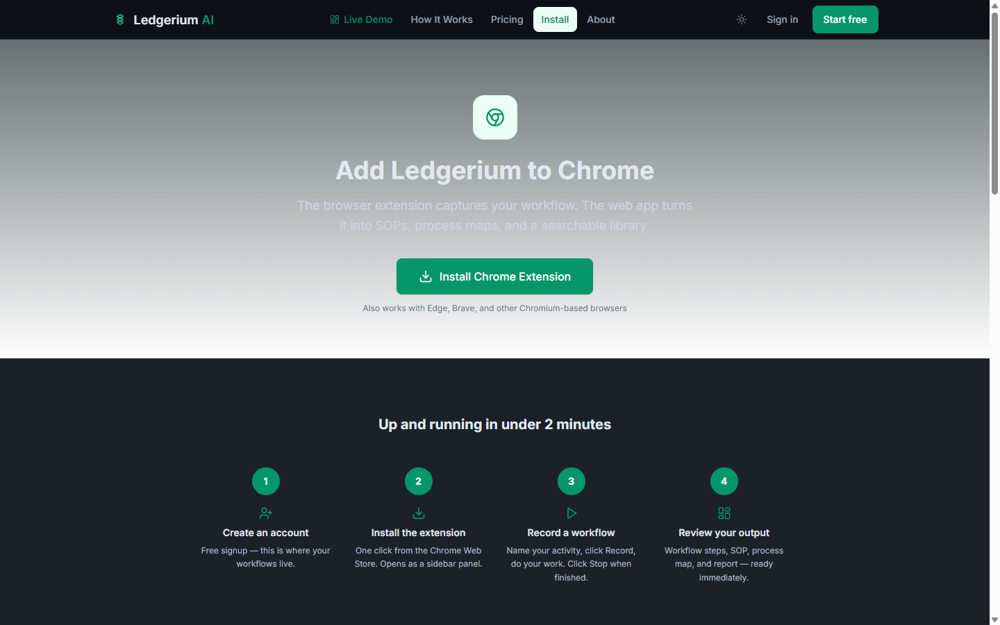

**Step 2 — Enable Developer Mode in Chrome**

Because the extension is installed directly (not from the Chrome Web Store), Chrome requires Developer Mode to be on.

1. In Chrome, go to `chrome://extensions`
2. Toggle **Developer mode** on (top-right corner of the page)

> **Note:** Developer Mode is a standard Chrome setting. It does not change your browser security for regular browsing — it simply allows manually installed extensions to run.

**Step 3 — Load the extension**

1. Unzip the downloaded file to a folder on your computer
2. On the `chrome://extensions` page, click **Load unpacked**
3. Select the folder you unzipped
4. The Ledgerium AI extension appears in your extension list

**Step 4 — Pin the extension**

1. Click the puzzle piece icon in the Chrome toolbar (top right)
2. Find **Ledgerium AI** in the list
3. Click the pin icon so the Ledgerium AI icon stays visible in your toolbar

---

### 1.3 Connecting the extension to your account

The extension syncs recordings to your web app account automatically once you give it an API key.

1. In the web app, go to **Account** (top navigation)
2. Scroll to **Extension Sync**
3. Click **New API Key**
4. Copy the key immediately — it is shown only once
5. Note the **Sync URL** shown on the page (e.g., `https://ledgerium.ai/api/sync`)

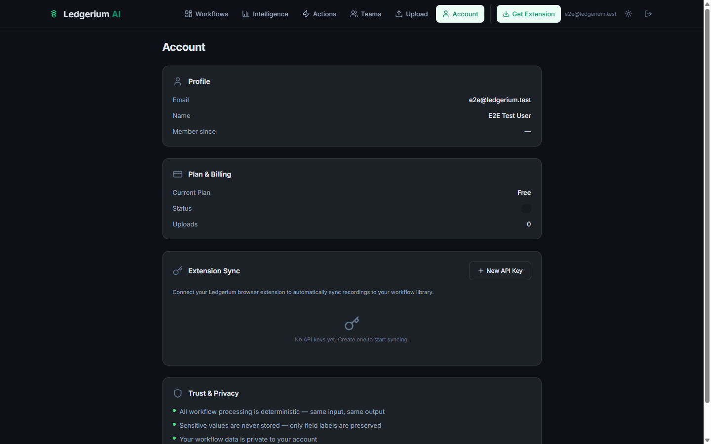

Now configure the extension:

1. Click the Ledgerium AI icon in your Chrome toolbar to open the side panel
2. Click **Sync Settings** at the bottom of the panel
3. Paste the **Sync URL** and your **API Key** into the fields
4. Click **Save**

The extension will now automatically upload recordings to your account when you stop recording.

---

### 1.4 Recording your first workflow

1. Navigate to the web application or browser tool you want to document
2. Click the Ledgerium AI icon in your Chrome toolbar to open the side panel
3. Enter a name for your workflow in the **Workflow name** field (e.g., "Process a new support ticket")
4. Click **Record**
5. A recording indicator confirms the session is live
6. Perform your workflow as you normally would
7. When finished, click **Stop**

The extension finalizes the session and, if sync is configured, uploads it to your account automatically. The workflow appears in your dashboard within seconds.

> **Tip:** Use a specific, descriptive name. "Submit a monthly expense report in Concur" is more useful than "expense test". The name becomes the workflow title in your library.

---

### 1.5 Uploading a workflow manually

If you recorded a workflow without sync configured, you can upload the JSON file directly.

1. In the web app, click **Upload** in the navigation bar
2. Drag and drop your `.json` file onto the upload area, or click to browse for the file
3. The platform validates the file and processes it
4. On success, you see the workflow title, step count, and detected tools
5. Click **View Workflow** to open it

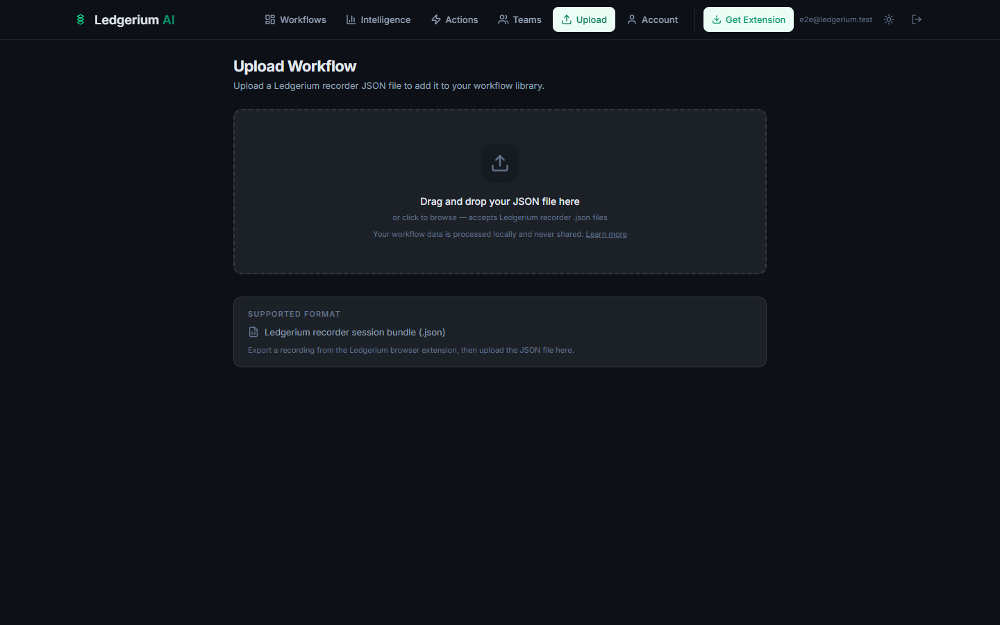

> **Note:** Upload only accepts `.json` files exported by the Ledgerium AI recorder. The file is validated against the session bundle schema before processing begins.

---

### 1.6 Loading a sample workflow

If you want to explore the platform before recording anything:

1. Go to your **Dashboard**
2. Click **Try a sample workflow**
3. A pre-built workflow loads into your library with all tabs and outputs populated


This is a good way to see what a fully processed workflow looks like before recording your own.

---

## 2. Dashboard and Workflow Library

The dashboard is your home base. It shows all your workflows and gives you quick access to search, filter, organize, and navigate to any recording.

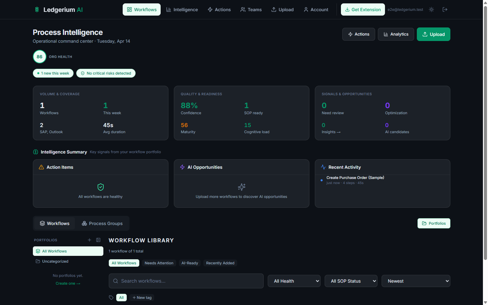

---

### 2.1 Dashboard layout

The dashboard has three main areas:

| Area | What it contains |
|------|-----------------|
| **Stats strip** | Quick summary counts: total workflows, steps recorded, SOP-ready workflows, and active tags |
| **Workflow cards** | Grid of all your workflows with key metadata at a glance |
| **Portfolio sidebar** | Folder tree for organizing workflows into named groups |

---

### 2.2 Searching and filtering

Use the toolbar above the workflow grid to find specific workflows.

**Search bar** — Type any part of a workflow title. Results update as you type.

**Sort options** — Click the sort dropdown to order workflows by:
- Date added (newest or oldest)
- Name (A-Z or Z-A)
- Step count (most or fewest)
- Duration (longest or shortest)

**Filter options** — Click the filter button to narrow results by:

| Filter | Options |
|--------|---------|
| **Health status** | Healthy, Needs attention, Unanalyzed |
| **SOP readiness** | SOP-ready, Not ready |
| **Tags** | Any tag applied to workflows |

**Preset views** — Use the quick-filter buttons to switch between:

- **All Workflows** — your complete library
- **Needs Attention** — workflows with health warnings or low confidence scores
- **AI-Ready** — workflows that meet the quality threshold for automation analysis
- **Recently Added** — workflows from the last 7 days

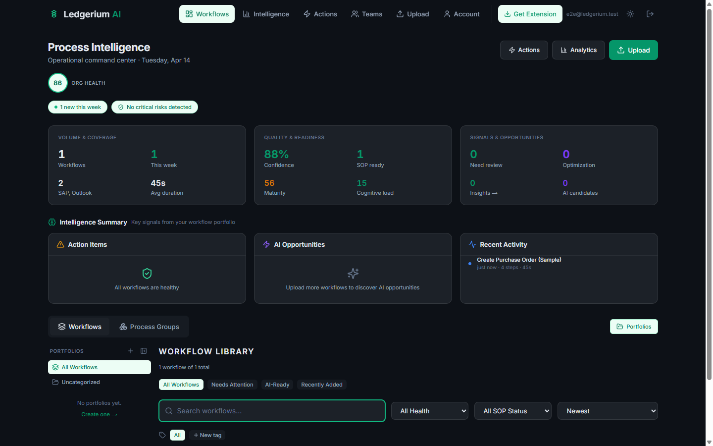

---

### 2.3 Workflow cards

Each card in the grid shows:

- **Title** — the workflow name from the recording
- **Confidence badge** — the engine's certainty in its step segmentation (color-coded: green is high, amber is moderate, red is low)
- **Duration** — total time the recorded session took
- **Step count** — number of workflow steps detected
- **Health status** — overall process health indicator
- **Tool badges** — applications used (e.g., Salesforce, Gmail, Workday)
- **Tags** — any labels applied to the workflow
- **Favorite star** — click to pin a workflow to the top of your library
- **Date** — when the recording was created

Hover over a card to reveal:
- **Pencil icon** — rename the workflow inline
- **Trash icon** — delete the workflow (with confirmation)

---

### 2.4 Portfolios

Portfolios are folders that let you group related workflows. For example: "Onboarding Workflows", "Finance Processes", "Support Playbooks".


**Creating a portfolio:**

1. In the sidebar, click the **+** icon next to "Portfolios"
2. Enter a name for the portfolio
3. Click **Create**

**Adding a workflow to a portfolio:**

1. Open a workflow detail page
2. Use the portfolio selector to assign it to a folder

**Navigating portfolios:**

- Click any portfolio name in the sidebar to filter the dashboard to only workflows in that group
- Portfolios can be nested to create a multi-level folder structure

---

### 2.5 Recording streak tracker

The dashboard shows a recording streak counter — the number of consecutive days you have recorded at least one workflow. This helps build a consistent documentation habit.

---

### 2.6 Process Groups view

Toggle between **Workflows** view and **Process Groups** view using the view selector above the grid.

Process Groups view clusters your recordings by detected process type rather than individual recordings. This is useful when you have multiple recordings of the same workflow and want to see them together as a family rather than as separate cards.

---

## 3. Workflow Detail View

Click any workflow card to open its detail page. This is where you access all the outputs generated from a recording.

---

### 3.1 Header

The header at the top of every workflow detail page shows:

- **Workflow title** — editable by clicking the title
- **Metadata row** — step count, total duration, phase count, confidence score, view count, and creation date
- **Tool badges** — all applications detected during the recording
- **Export buttons** — JSON, Report, and SOP download buttons
- **Share button** — enable a public link for this workflow

---

### 3.2 Exporting from the header

Three export buttons appear in the top-right corner of the workflow detail page:

| Button | What downloads |
|--------|---------------|
| **JSON** | Full structured output: process run, process definition, process map, and SOP in a single file |
| **Report** | Workflow report as a structured document |
| **SOP** | Standard operating procedure as a standalone document |

Files are named after the workflow title (e.g., `process-support-ticket-sop.json`).

---

### 3.3 Sharing a workflow

Click **Share** in the workflow header to open the sharing dialog. See [Section 8](#8-sharing-workflows) for full details.

---

## 3.1 Process Map (Workflow Tab)

The Workflow tab renders your recorded process as an interactive visual map. It has four display modes, selectable from the toolbar.


---

### Flow Intelligence mode (default)

Flow Intelligence is the default view. It shows the step-by-step execution of your workflow as a connected node graph.

- **Phases** — steps are grouped into phases (e.g., "Initiation", "Processing", "Completion") shown as labeled swim bands
- **Step nodes** — each node shows the step title, category badge, and duration
- **Decision nodes** — branching points in the workflow appear as diamond shapes
- **Friction indicators** — steps flagged as slow or error-prone are highlighted with an amber or red border
- **Interactive canvas** — scroll to zoom, drag to pan, use the minimap in the bottom-right corner to navigate large workflows

---

### Swimlane mode

Swimlane view reorganizes the workflow into horizontal lanes, one per detected system or application.

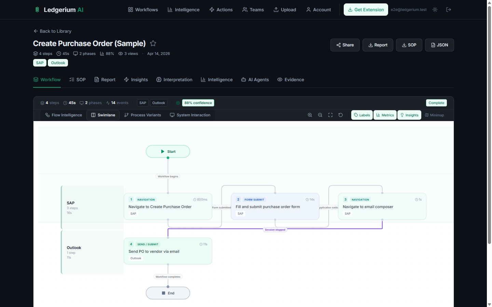

- Each lane represents a different tool (e.g., Salesforce, Gmail, Workday)
- **Handoff edges** — transitions between systems are shown as curved arrows crossing lane boundaries
- This view is best for workflows that move across multiple tools, showing exactly where the work transfers between systems

---

### Process Variants mode

Variants mode overlays all execution paths observed across recordings of the same process.

- The **standard path** (most common sequence) is shown in blue
- **Deviations** — steps taken in some runs but not others — appear as branching paths
- A similarity score shows how closely this recording matches the standard path
- Use this view to identify where your team's execution is inconsistent

---

### System Interaction mode

System Interaction mode focuses on cross-system integration patterns rather than step sequence.

- Shows which systems interact with each other during the workflow
- Handoff points and integration dependencies are foregrounded
- Useful for identifying where system integrations could be automated or where API calls happen

---

### Toolbar controls

The toolbar above the canvas gives you display toggles:

| Toggle | What it does |
|--------|-------------|
| **Labels** | Show or hide step labels on nodes |
| **Metrics** | Show or hide duration and event count on each node |
| **Insights** | Highlight steps with associated findings |
| **Minimap** | Show or hide the navigation minimap |
| **Legend** | Show or hide the color and shape legend |

---

### Inspector panel

Click any node on the canvas to open the Inspector panel on the right. The Inspector shows:

- **Step title** — the name of the step
- **Category** — the classification (Navigation, Form Submit, Data Entry, Send/Submit, File Action, Error Handling, Annotation, Action)
- **Duration** — how long this step took in the recording
- **Systems** — which applications were active during this step
- **Procedure** — the operational definition of what happened
- **Expected outcomes** — what should result when this step is completed correctly
- **Warnings** — any flags the engine raised (e.g., sensitive field detected, low confidence)

---

## 3.2 SOP Tab

The SOP tab presents the Standard Operating Procedure derived from the recording. Every instruction traces back to an observed event — no content is fabricated.

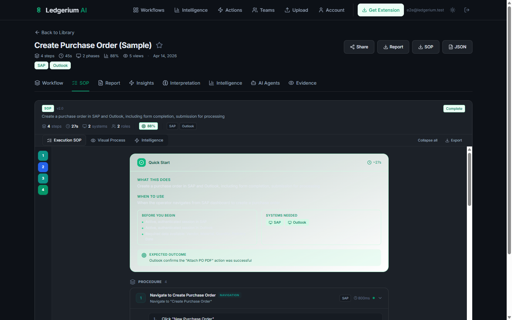

The SOP tab has three sub-modes:

---

### Execution SOP (default)

The Execution SOP is the primary reference document. It is structured for a person performing the task.

Each step card shows:

- **Step number** — sequential position in the procedure
- **Title** — what the step accomplishes
- **Category** — the type of action (color-coded badge)
- **Operational definition** — a clear instruction describing exactly what to do
- **Expected outcome** — what should happen when the step is complete
- **Duration** — how long this step typically takes
- **Related systems** — which tools are involved
- **Warnings** — flags for sensitive data, non-standard behavior, or low-confidence segments

Use **Expand All** to open every step card at once. Use **Collapse All** to return to the summary view.

---

### Visual Process mode

Visual Process groups the SOP steps by phase and adds system context alongside each step. This is useful for reviewing the workflow at a higher level before reading the detailed instructions.

---

### Intelligence mode

Intelligence mode overlays process analysis on top of the SOP:

- **Friction points** — steps that are unusually slow, error-prone, or frequently retried are highlighted
- **Decision criteria** — steps where branching logic was observed are flagged
- **Rework loops** — sequences where the user navigated backward or repeated steps are identified
- **Optimization opportunities** — steps that the engine has flagged as candidates for simplification or automation

---

## 3.3 Report Tab

The Report tab provides a structured summary of the workflow, formatted for sharing with stakeholders or managers who need an overview rather than full operational detail.

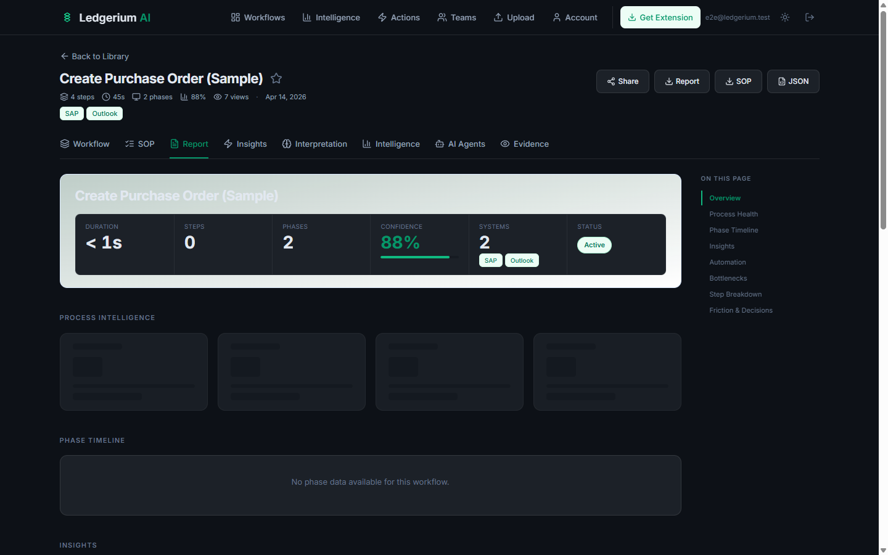

The report contains:

**Health scorecard** — a 0-100 score with color interpretation:

| Score range | Status |
|-------------|--------|
| 80-100 | Healthy — process is well-structured and consistent |
| 60-79 | Moderate — some friction or variance detected |
| 40-59 | Needs attention — notable issues present |
| 0-39 | Critical — significant problems detected |

**Key metrics:**
- Total duration and average step duration
- Step count and distribution across phases
- Completion rate (if multiple runs exist)
- Error frequency

**Performance insights:**
- Bottlenecks — steps that consume a disproportionate share of total time
- Friction points — steps where errors, retries, or delays were detected
- Rework patterns — loops or repeated sequences
- System interactions — count of application handoffs

**Recommendations** — a summarized list of suggested improvements, each linked to specific evidence from the recording.

---

## 3.4 Insights Tab

The Insights tab surfaces specific, actionable findings from the process analysis, categorized by severity.


**Severity levels:**

| Severity | Color | Meaning |
|----------|-------|---------|
| Critical | Red | A significant issue that affects process reliability or quality |
| Warning | Amber | A notable issue worth addressing |
| Info | Blue | An observation or opportunity, not urgent |

Each insight card shows:

- **Title** — a plain-language description of the finding
- **Type** — the category (Bottleneck, Friction, Rework, Variance, Anomaly)
- **Explanation** — why this matters, with specific data points from the recording
- **Affected steps** — which step numbers are involved
- **Recommendation** — a concrete suggested action

Click the **X** on any insight card to dismiss it once you have reviewed it. Dismissed insights are removed from view but not permanently deleted.

---

## 3.5 Interpretation Tab

The Interpretation tab provides an analytical summary of the process structure, written for process owners and improvement leads.

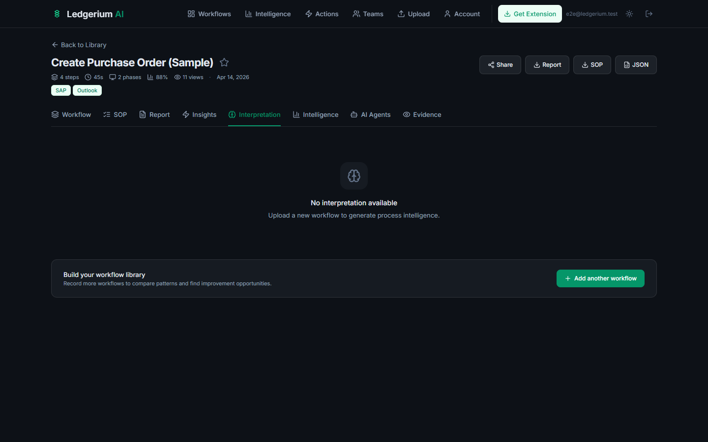

**Executive summary** — a paragraph-level description of what the process does, who performs it, and what systems are involved.

**Process type classification** — the engine's assessment of the process category (e.g., "Data Entry Workflow", "Multi-System Approval Process") with a confidence score.

**Complexity scores** — four 0-100 scores measuring different dimensions:

| Score | What it measures |
|-------|----------------|
| Complexity | Overall process complexity based on step count, decisions, and system count |
| Friction | How much effort or re-work was detected in the execution |
| Linearity | How consistently the process follows a single sequential path (higher = more linear) |
| Manual intensity | The proportion of steps that require direct human action with no automation |

**Phase breakdown** — each detected phase with its dominant action types and step count.

**Friction analysis** — identified friction points with severity rating and the specific evidence that triggered the flag.

**Decision points** — steps where branching or conditional logic was observed, with the criteria detected.

**Rework patterns** — any loops, retries, or backward navigation detected in the recording.

---

## 3.6 Intelligence Tab

The Intelligence tab shows detailed performance metrics, typically populated when multiple recordings of the same process are available for comparison.

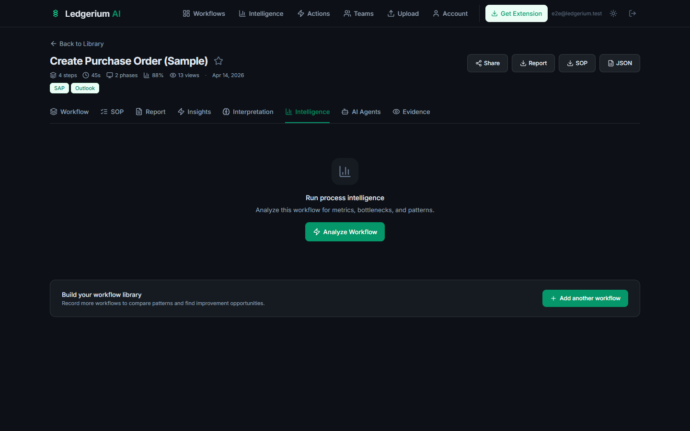

**Process metrics:**
- Run count — how many times this process has been recorded
- Completion rate — percentage of runs that completed without errors
- Duration statistics — median, mean, and P90 duration for the full workflow

**Variant analysis:**
- Standard path — the most commonly observed sequence of steps
- All variants — alternative execution paths detected across runs
- Similarity scores — how closely each run matches the standard path

**Time study:**
- Per-step duration breakdown showing mean, median, and P90 for each step position
- Highlights steps with high variance (inconsistent timing across runs)

**SOP alignment:**
- Alignment score — how closely the observed execution matches the documented SOP
- Undocumented steps — steps observed in recordings that are not in the current SOP
- Drift indicators — signs that the process has changed since the SOP was last updated

---

## 3.7 AI Agents Tab

The AI Agents tab analyzes the workflow from an automation perspective, identifying which steps are candidates for AI or robotic process automation.

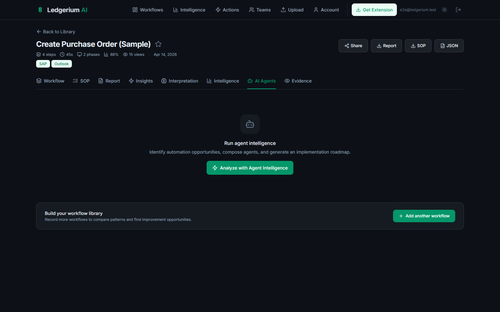

**Agent composition** — a map of which AI agent types could cover each phase or step of the process (e.g., data extraction agent, form-fill agent, decision agent).

**Automation suitability per step:**
- Each step is scored for automation suitability (0-100)
- Low scores indicate steps requiring human judgment or contextual awareness that is difficult to automate
- High scores indicate steps that are rule-based, repetitive, and well-suited for automation

**Effort and complexity estimates:**
- Estimated development effort to automate each step
- Complexity classification (Low / Medium / High)

**Success probability:**
- The engine's estimate of how reliably an automation would succeed for each step, based on observed execution consistency

**Integration risk assessment:**
- Flags steps that interact with systems that may not have APIs
- Identifies dependencies that could complicate an automation build

> **Note:** The AI Agents tab is available on Growth and Enterprise plans.

---

## 3.8 Evidence Tab

The Evidence tab shows the raw structured data that underlies all outputs. It is designed for engineers, auditors, and compliance reviewers who need to inspect exactly what was captured and how outputs were derived.

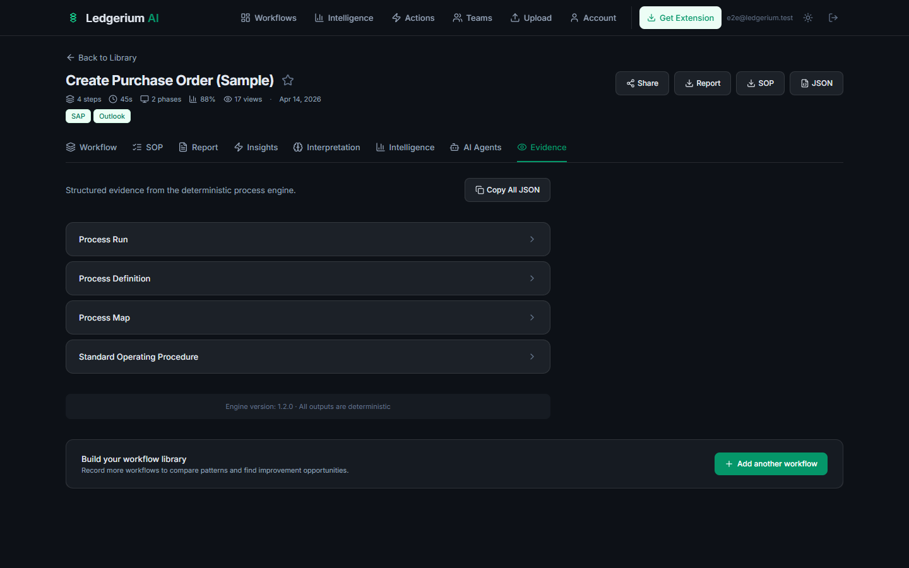

**Step-by-step event log** — every captured interaction in the recording, listed with:
- Timestamps
- Event type (click, navigation, form input, page load, etc.)
- Target element metadata
- Whether the event was a human action or a system response

**Human events vs. system events:**
- Human events are direct user actions (clicks, keyboard interactions, form submissions)
- System events are page loads, navigation responses, and state changes triggered by user actions

**Downloadable raw event data** — click **Copy All JSON** to copy the complete evidence bundle to your clipboard, or use the export buttons in the header to download it as a file.

All outputs are deterministic — the same recording always produces the same evidence structure, making it suitable for audit and compliance purposes.

---

## 4. Process Intelligence (Analytics)

The Intelligence page provides portfolio-level analysis across all your workflows. Instead of looking at one recording at a time, it surfaces patterns, comparisons, and insights across your entire library.

Access it by clicking **Intelligence** in the top navigation bar.


---

### 4.1 Running analysis

Click **Run Analysis** to trigger the intelligence engine. This:

1. Clusters similar workflows into **process families** based on step sequence patterns
2. Computes aggregate metrics across all runs within each family
3. Detects bottlenecks, variance, and drift at the portfolio level
4. Generates actionable insights and standardization recommendations

> **Tip:** Run analysis periodically as you add new recordings to catch drift and new patterns that emerge over time.

---

### 4.2 Executive summary KPIs

Four summary cards at the top of the page:

| KPI | What it shows |
|-----|--------------|
| **Total Workflows** | Count of all recordings in your library |
| **Process Families** | Number of distinct process types detected |
| **Variants Detected** | Count of alternative execution paths across all families |
| **Avg Stability Score** | Portfolio-wide average of how consistently processes are executed |

---

### 4.3 Process health overview

A breakdown of your library by health status:

- **Stable** — processes executed consistently across runs
- **Moderate** — some variance or friction present
- **Unstable** — significant inconsistency or repeated errors
- **Unanalyzed** — workflows not yet included in an analysis run

---

### 4.4 Process families

Process families are clusters of similar workflows. For example, if you have ten recordings all documenting "how we process a refund request", the intelligence engine groups them into a single family called "Process Refund Request" and analyzes them together.

Each family card shows:
- **Canonical name** — the most representative title across all runs in the family
- **Run count** — how many recordings belong to this family
- **Variant count** — how many different execution paths were observed
- **Average duration** — typical time to complete the process
- **Stability score** — percentage of runs that follow the standard path
- **Insight badges** — any critical or warning findings for this family

Click any family card to drill into the Process Detail view.

---

### 4.5 Performance leaderboard

Three ranked lists surfacing the workflows most in need of attention:

- **Slowest processes** — families with the highest average duration
- **Highest variation** — families with the most inconsistent execution
- **Fastest processes** — families that are well-optimized and consistent

---

### 4.6 Standardization opportunities

A ranked list of process families where standardization would have the greatest impact — typically families with high variance, many variants, and low stability scores.

---

### 4.7 Active signals and insights

Portfolio-level findings that span multiple families or represent systemic patterns. Examples:

- A tool appearing as a friction point across many different processes
- A system handoff that repeatedly causes delays
- A process family whose stability score has declined over recent recordings (drift)

Each signal includes the affected families, the evidence behind the finding, and a recommended action.

---

## 4.1 Process Detail

Click any process family to open the Process Detail view.

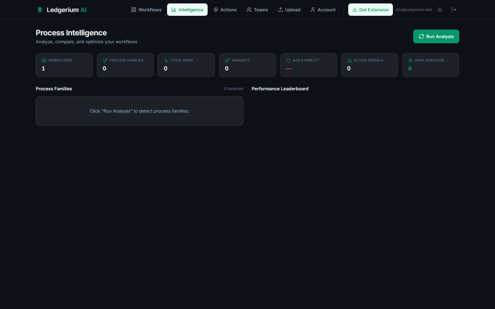

---

### Time study analysis

A per-step duration breakdown for all runs in the family:
- Mean, median, and P90 duration for each step position
- Steps where duration varies significantly across runs are flagged
- Bottleneck identification — steps consuming a disproportionate share of total process time

---

### Variance analysis

Three variance measures:

| Measure | What it shows |
|---------|--------------|
| **Duration CV** | Coefficient of variation for total process duration — how inconsistent the total time is |
| **Step count CV** | How much the number of steps varies run to run |
| **Sequence stability** | Percentage of runs that follow the standard step sequence |

---

### Process variants

A visualization of all execution paths observed across runs:
- The standard path (most common) is shown prominently
- Alternative paths are shown with their frequency
- Outlier runs (significantly different from all others) are flagged separately

---

### SOP alignment

- **Alignment score** — how closely observed executions match the documented SOP
- **Undocumented steps** — steps observed in recordings not captured in the current SOP
- **Drift indicators** — evidence that the process has changed since the SOP was created

---

### Standardization scorecard

A summary of how ready this process is for standardization, based on:
- Variant count and diversity
- Stability score
- SOP alignment score
- Error frequency

---

### Automation ROI candidates

Steps within this process family ranked by automation potential and estimated impact:
- Expected time savings per run
- Automation suitability score
- Required effort estimate

---

### AI recommendations

AI-generated recommendations specific to this process family, each showing:

| Field | Description |
|-------|-------------|
| **Type** | Standardize, Update SOP, Automate, Reduce Rework, etc. |
| **Impact** | Expected improvement magnitude (High / Medium / Low) |
| **Confidence** | How strongly the evidence supports this recommendation |
| **Effort** | Implementation effort estimate |
| **Evidence** | The specific data points that triggered this recommendation |

---

## 5. Recommendations Center

The Recommendations page aggregates all AI-generated recommendations across your entire workflow library into one place.

Access it by clicking **Recommendations** in the navigation bar.

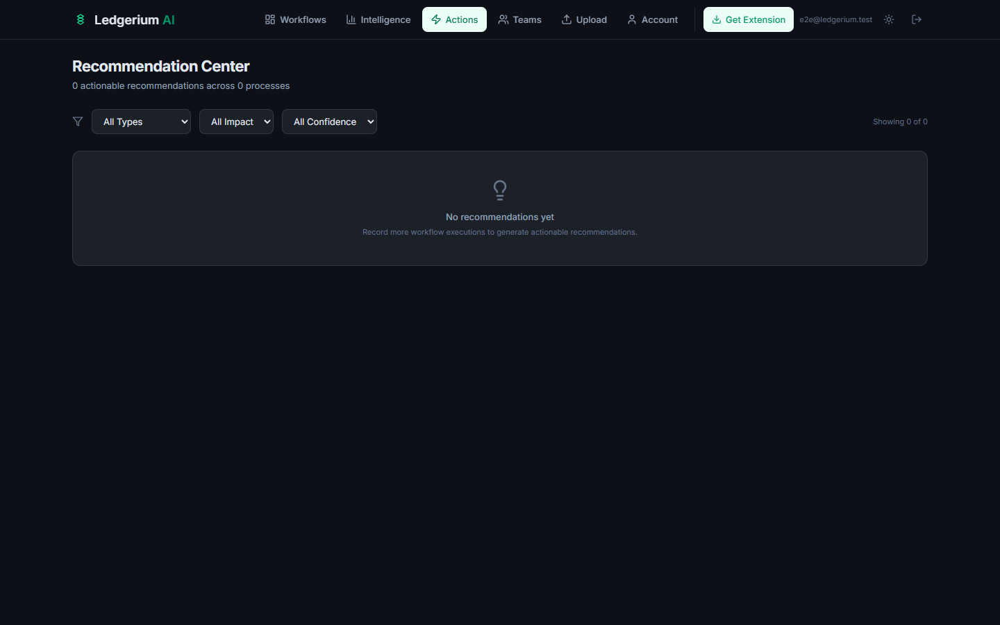

---

### Filtering recommendations

Use the filter toolbar to narrow the list:

- **By type** — Standardize, Update SOP, Automate, Reduce Rework, Optimize Handoff, and others
- **By impact** — High, Medium, Low
- **By confidence** — how strongly the evidence supports the recommendation

---

### Recommendation cards

Each card shows:

- **Type badge** — the category of recommendation
- **Title** — a plain-language description of the suggested action
- **Process** — which process family this recommendation applies to
- **Description** — the full explanation of what to do and why
- **Impact badge** — expected improvement magnitude
- **Confidence badge** — evidence strength
- **Effort badge** — estimated work required to act on it

Click **View Process** on any recommendation card to go directly to the Process Detail page for deeper analysis.

---

## 6. Teams and Collaboration

Teams allow multiple users to share a workflow library, record together, and collaborate on process documentation.

---

### 6.1 Creating a team

1. Click **Teams** in the navigation bar
2. Click **Create Team**
3. Enter a team name
4. Click **Create**

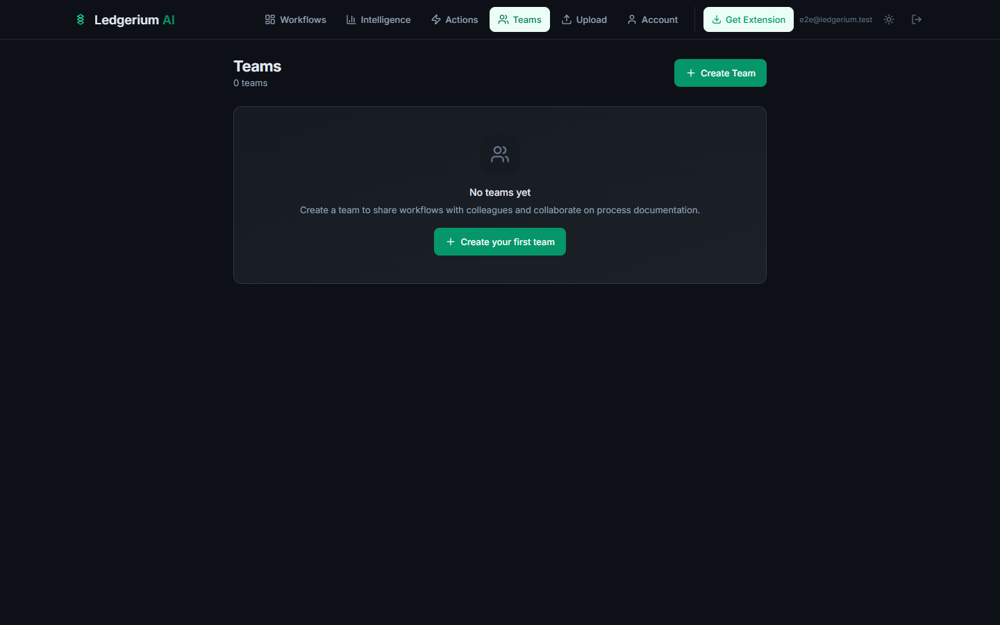
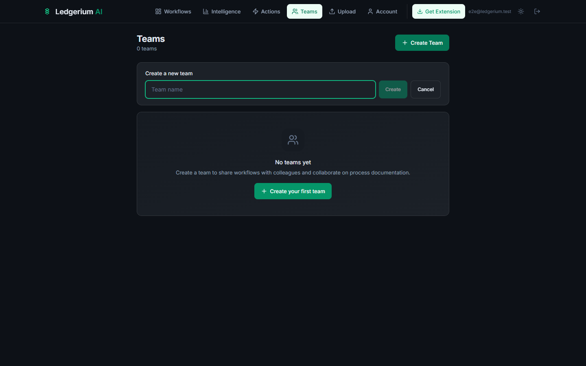

---

### 6.2 Inviting team members

1. Go to your team's page
2. Click **Invite Member**
3. Enter the email address of the person you want to invite
4. Select their role (see role definitions below)
5. Click **Send Invite**

The invitee receives a link. They can follow it to join the team — even if they do not yet have a Ledgerium account.

---

### 6.3 Member roles

| Role | What they can do |
|------|----------------|
| **Owner** | Full control: manage billing, delete the team, assign any role |
| **Admin** | Manage members, invite others, manage all workflows and portfolios |
| **Member** | Record workflows, upload, view and edit shared library, create portfolios |
| **Viewer** | Read-only access to the shared library, no recording permissions |

---

### 6.4 Managing team members

On the team page:
- **Change role** — click the role badge next to a member's name and select a new role
- **Remove member** — click the remove button next to a member and confirm

Removing a member revokes their access to the shared library immediately. Their past recordings remain in the library.

---

### 6.5 Accepting a team invitation

1. Click the invite link sent to your email
2. If you already have an account, you are taken directly to the team
3. If you are new to Ledgerium, you will be prompted to create an account first, then automatically joined to the team

---

### 6.6 Shared workflow library

Once on a team, all Member and Admin recordings are visible in the shared team library. Portfolio organization applies across the whole team. Any team member with the appropriate role can:
- View, search, and filter all workflows
- Export workflows
- Assign workflows to portfolios
- Run intelligence analysis across the full team library

---

## 7. Account and Settings

Access your account by clicking **Account** in the top navigation bar.


---

### 7.1 Profile information

Your profile section shows:
- Email address (read-only)
- Display name (editable)
- Member since date

---

### 7.2 Plan and billing

Your current plan and usage are shown in the billing section:
- Current plan name and status
- Recording usage this month (e.g., "3 of 5 recordings used")
- Upgrade button (for Free and Starter users)
- Manage subscription link (for paid users — opens the Stripe billing portal where you can update payment details, view invoices, or cancel)

See [Section 10](#10-plans-and-pricing) for a full plan comparison.

---

### 7.3 Extension sync setup

The Extension Sync section is where you create and manage API keys for connecting the Chrome extension to your account. See [Section 1.3](#13-connecting-the-extension-to-your-account) for the full setup walkthrough.

---

### 7.4 API key management


You can create up to 3 API keys. For each key:
- The key prefix is shown (the full key is only shown at creation time)
- The last-used date is displayed
- Click the **trash icon** to revoke a key

> **Important:** Revoking a key immediately disconnects any extension using that key. You will need to create a new key and reconfigure the extension.

---

### 7.5 Trust and privacy

The account page includes a summary of Ledgerium AI's trust and privacy commitments. For the full policy, see [Section 11](#11-privacy-and-security) of this guide.

---

## 8. Sharing Workflows

You can share any workflow with someone outside your account using a public link — no login required for the viewer.

---

### 8.1 Enabling sharing

1. Open the workflow you want to share
2. Click the **Share** button in the workflow header
3. Toggle sharing on in the dialog

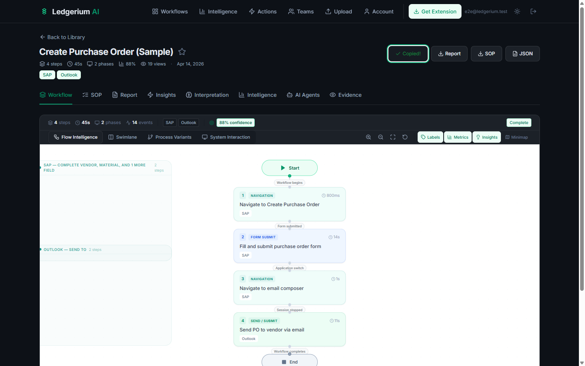

A public URL is generated, for example:
```
https://ledgerium.ai/share/abc123xyz
```

4. Click **Copy Link** to copy the URL to your clipboard

---

### 8.2 What shared viewers see

Visitors with the public link can view:
- The workflow metadata (title, step count, duration, confidence, tools)
- The SOP tab — full standard operating procedure
- The Report tab — health scorecard and key metrics

Shared viewers cannot:
- Edit the workflow
- Access the Evidence tab
- Download raw JSON
- Access your other workflows

---

### 8.3 Revoking shared access

1. Open the workflow
2. Click **Share**
3. Toggle sharing off

The previous link immediately stops working. If you re-enable sharing, a new unique link is generated.

---

## 9. Exporting Data

Ledgerium AI outputs are designed to be portable. You can export in multiple formats from the workflow detail page.

---

### 9.1 Export formats

| Format | Description | Available on |
|--------|-------------|-------------|
| **JSON** | Complete structured output: process run, definition, map, and SOP in a single machine-readable file | All plans |
| **Markdown** | Human-readable SOP formatted as Markdown, suitable for documentation systems like Notion, Confluence, or GitHub | Starter and above |
| **BPMN** | Business Process Model and Notation format for import into process modeling tools | Growth and Enterprise |

---

### 9.2 Exporting SOPs

From the workflow detail page, click the **SOP** export button in the header. This downloads the full standard operating procedure, including:
- Purpose and scope
- Prerequisites
- All numbered procedure steps with instructions and expected outcomes
- Completion criteria

---

### 9.3 Exporting reports

Click the **Report** export button in the header. The report includes:
- Executive summary
- Key metrics
- Performance insights
- Recommendations

---

### 9.4 Exporting raw workflow data

Click the **JSON** export button for the complete structured output. This is the most complete export, containing all process engine data. Use it for:
- Archiving recordings for compliance
- Importing into custom tools or pipelines
- Sharing with engineering teams building automations

---

### 9.5 Watermarked vs. clean exports

| Plan | Export quality |
|------|---------------|
| Free | Watermarked exports — include a Ledgerium AI attribution footer |
| Starter and above | Clean exports — no watermark |

---

## 10. Plans and Pricing

Ledgerium AI offers five plan tiers. Annual billing saves approximately 17% compared to monthly billing.

---

### Plan comparison

| Feature | Free | Starter | Team | Growth | Enterprise |
|---------|------|---------|------|--------|-----------|
| **Price (monthly)** | $0 | $49/mo | $249/mo | $799/mo | Custom |
| **Price (annual)** | — | $41/mo | $207/mo | $665/mo | Custom |
| **Seats** | 1 user | 1 recorder | 3 recorders + 5 viewers | Up to 10 recorders, 15 seats | Custom |
| **Recordings per month** | 5 | 15 | Unlimited | Unlimited | Custom |
| **SOP + process map** | Yes | Yes | Yes | Yes | Yes |
| **Public sharing** | Yes | Yes | Yes | Yes | Yes |
| **Export quality** | Watermarked | Clean | Clean | Clean | Clean |
| **Basic health scores** | No | Yes | Yes | Yes | Yes |
| **Full intelligence layer** | No | No | Yes | Yes | Yes |
| **Bottleneck and friction analysis** | No | No | Yes | Yes | Yes |
| **Automation opportunity scoring** | No | No | Yes | Yes | Yes |
| **Variant and rework detection** | No | No | Yes | Yes | Yes |
| **Shared team library** | No | No | Yes | Yes | Yes |
| **Advanced analytics** | No | No | No | Yes | Yes |
| **Cross-workflow comparison** | No | No | No | Yes | Yes |
| **AI agent composition** | No | No | No | Yes | Yes |
| **SSO and RBAC** | No | No | No | No | Yes |
| **Audit trail** | No | No | No | No | Yes |
| **On-premise option** | No | No | No | No | Yes |

---

### Plan details

**Free** — For individuals exploring the platform. Record up to 5 workflows per month, generate SOPs and process maps, and share via public link. Exports include a Ledgerium AI watermark. No intelligence layer or team features.

**Starter ($49/mo)** — For operations team leads documenting their own processes. 15 recordings per month, clean exports in JSON and Markdown, basic process health scores, and a personal workflow workspace. No bottleneck analysis or automation scoring.

**Team ($249/mo)** — For process improvement teams. Unlimited recordings, full intelligence layer, bottleneck and friction analysis, automation opportunity scoring, variant and rework detection, and a shared team workspace with portfolios.

**Growth ($799/mo)** — For AI implementation leads. Everything in Team, plus advanced analytics, cross-workflow comparison, priority export formats including BPMN, AI agent composition analysis, and integration risk assessment.

**Enterprise (custom pricing)** — For compliance-sensitive or large-scale deployments. Custom seat and recorder counts, SSO and RBAC, audit trail and compliance exports, dedicated support, on-premise deployment option, and custom retention policies. Contact [hello@ledgerium.ai](mailto:hello@ledgerium.ai?subject=Ledgerium%20Enterprise) to discuss requirements.

---

### Upgrading your plan

1. Go to **Account** in the navigation bar
2. Click **Upgrade Now** in the Plan and Billing section
3. Select your desired plan
4. Complete payment via Stripe's secure checkout
5. Your account is upgraded immediately

---

## 11. Privacy and Security

Ledgerium AI is designed as a trust-first platform. This section explains exactly what the extension captures, what it does not capture, and what controls you have.

---

### 11.1 What the extension captures

When recording is active, the extension captures:

- **Click events** — where you clicked, what type of element was clicked (button, link, field), and when
- **Navigation events** — page transitions, URL changes (at the domain/path level)
- **Form field interactions** — which field was interacted with and what type of field it is (text, dropdown, checkbox), but not the content typed
- **Timing data** — how long each step and the overall session took
- **Application context** — which tools and domains were active at each point in the workflow

---

### 11.2 What the extension does NOT capture

Ledgerium AI never intentionally captures:

- Screenshots or screen video
- Keystrokes or typed content
- Passwords, credentials, or one-time codes
- Clipboard contents
- Microphone audio or camera video
- Background activity when recording is stopped
- Content in private messaging tools unrelated to the workflow being recorded
- Hidden form field values that expose credentials or security context

> **The platform's design principle is data minimization: capture only what is needed to reconstruct the workflow, and no more.**

---

### 11.3 Automatic sensitive value redaction

Input elements known to be sensitive — password fields, payment fields, and fields with standard `autocomplete` attributes indicating credential or financial data — are automatically excluded from capture at the point of recording.

This means even if you are recording a workflow that involves a login step, the password you type is never sent to Ledgerium AI.

---

### 11.4 Recording state visibility

The extension always shows you when recording is active. There is no background or hidden recording state. You can:

- See the live recording indicator in the side panel
- Pause recording at any time with a single click
- Stop recording at any time with a single click
- Review captured steps before uploading
- Discard a recording if you do not want to keep it

---

### 11.5 Data storage and access controls

- Recordings uploaded to your account are stored securely in Ledgerium AI's infrastructure
- Data is encrypted in transit (HTTPS/TLS)
- Access to your workflows is controlled by your account credentials
- Team workflows are only visible to members of your team with the appropriate role
- Ledgerium AI staff do not access your workflow data except where required to resolve a support issue you have explicitly raised

---

### 11.6 User control summary

| Control | How to use it |
|---------|--------------|
| Start recording | Click Record in the extension side panel |
| Pause recording | Click Pause in the extension side panel |
| Stop recording | Click Stop in the extension side panel |
| Discard a recording | Use the discard option before uploading |
| Review before uploading | Review steps in the extension panel, then sync manually or let auto-sync run |
| Delete a workflow | Hover over the workflow card and click the trash icon |
| Revoke extension access | Delete the API key in Account > Extension Sync |

---

## 12. Troubleshooting and FAQ

---

### Extension not visible after install

**Problem:** The extension installed but you cannot see the icon in the Chrome toolbar.

**Solution:**
1. Click the puzzle piece icon in the Chrome toolbar (top right)
2. Find **Ledgerium AI** in the extension list
3. Click the pin icon to pin it to the toolbar

---

### How to enable Developer Mode

**Problem:** Chrome is asking you to enable Developer Mode before you can load the extension.

**Solution:**
1. In Chrome, navigate to `chrome://extensions`
2. Toggle **Developer mode** on using the switch in the top-right corner of the page
3. Return to the Load unpacked step

> **Note:** Developer Mode in Chrome does not reduce your browser's security for normal web browsing. It only permits manually installed extensions to run.

---

### Extension not syncing

**Problem:** You stop a recording but the workflow does not appear in your dashboard.

**Checklist:**
1. Open the extension side panel and click **Sync Settings**
2. Confirm the Sync URL is set to `https://ledgerium.ai/api/sync`
3. Confirm the API key is pasted in full with no extra spaces
4. Verify the API key has not been revoked in Account > Extension Sync
5. Check your internet connection
6. Try uploading the recording manually via the Upload page as a fallback

---

### Dashboard is empty

**Problem:** You can log in but your dashboard shows no workflows.

**Solutions:**
- If you have not recorded anything yet, click **Try a sample workflow** to load a pre-built example
- If you have recorded but not synced, go to **Upload** and manually upload the `.json` file from the extension
- If you have workflows that are not appearing, check whether a portfolio or filter is active in the sidebar that is hiding them

---

### Recording not capturing events

**Problem:** You are recording but the extension is not showing events in the step list.

**Checklist:**
1. Confirm the recording indicator shows **Recording Active** in the side panel
2. Some pages restrict extensions. If you are on a Chrome system page (`chrome://`, `chrome-extension://`) or a page the extension does not have permission for, events will not capture. Navigate to a normal web application and try again
3. Try clicking the extension icon, stopping the current session, and starting a new recording
4. If the problem persists on a specific application, contact support at [hello@ledgerium.ai](mailto:hello@ledgerium.ai)

---

### Forgot password

Ledgerium AI does not currently offer a self-service password reset link. Contact support at [hello@ledgerium.ai](mailto:hello@ledgerium.ai) to reset your password.

---

### What does "confidence score" mean?

The confidence score reflects how certain the deterministic process engine is about the step boundaries it detected. A high confidence score (green) means the engine cleanly identified where one step ended and another began. A lower score (amber or red) means there was ambiguity in the recording — for example, very rapid navigation, overlapping actions, or unusual interaction patterns.

A lower confidence score does not mean the recording is wrong. It means you may want to review the step breakdown manually in the Evidence tab and compare it against what you actually did.

---

### Can I record workflows across multiple tabs?

Yes. The extension captures events across all active tabs during a recording session. Multi-tab workflows are common when a process moves between a CRM tab, an email tab, and a spreadsheet, for example. The Swimlane view in the process map will show each application in its own lane.

---

### Is Ledgerium AI GDPR or HIPAA compliant?

The platform is designed with data minimization principles and does not capture sensitive personal content. However, compliance readiness depends on your specific deployment context, the workflows you record, and your organization's governance policies.

If you are operating in a regulated environment (healthcare, financial services, legal), contact [hello@ledgerium.ai](mailto:hello@ledgerium.ai) before deploying to discuss your requirements.

---

### How do I contact support?

Email [hello@ledgerium.ai](mailto:hello@ledgerium.ai) for any questions not covered in this guide. Include your account email and a description of what you were trying to do and what happened.

---

*Ledgerium AI — Evidence-based workflow intelligence*
*Last updated: April 2026*
