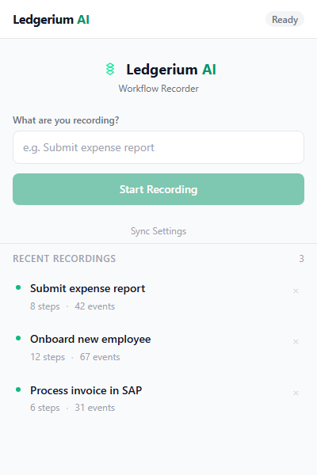
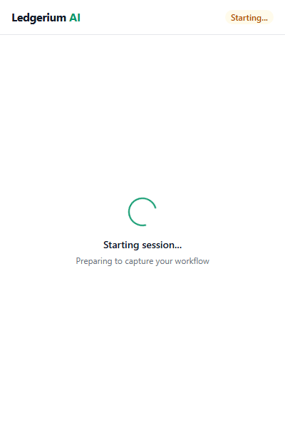
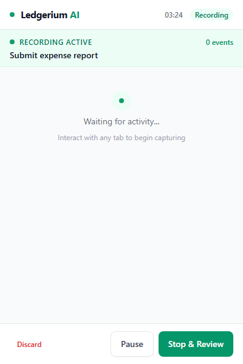
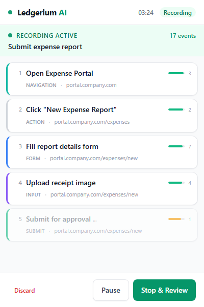
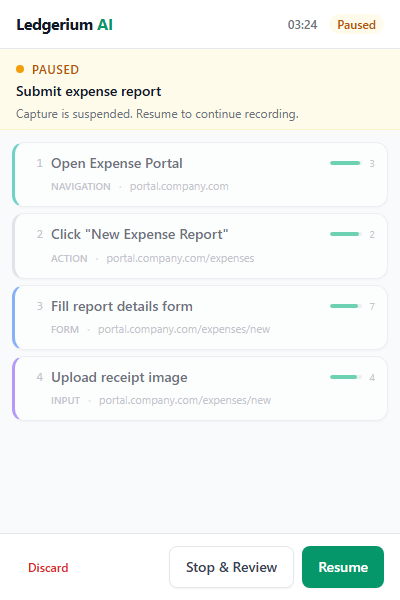
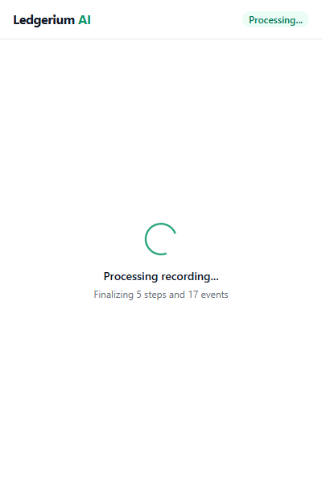
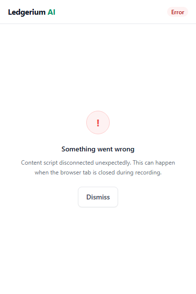

# Ledgerium AI — Browser Extension User Guide

The Ledgerium AI Chrome extension captures your real browser workflows and converts them into structured, deterministic process documentation. This guide walks you through every feature of the extension.

---

## Table of Contents

1. [Getting Started](#getting-started)
2. [Home Screen](#home-screen)
3. [Starting a Recording](#starting-a-recording)
4. [Recording in Progress](#recording-in-progress)
5. [Pausing a Recording](#pausing-a-recording)
6. [Stopping & Reviewing](#stopping--reviewing)
7. [Error Handling](#error-handling)
8. [Recent Recordings](#recent-recordings)
9. [Tips & Best Practices](#tips--best-practices)

---

## Getting Started

After installing the Ledgerium AI extension from the Chrome Web Store, you can access it from Chrome's **side panel**. Click the Ledgerium AI icon in your extensions toolbar, or use Chrome's side panel menu to open it.

Before your first recording, make sure you've connected the extension to your Ledgerium AI account by clicking **Sync Settings** on the home screen and entering your API key (available from your Ledgerium AI dashboard under Settings → Extension).

---

## Home Screen

The home screen is your starting point. Here you can:

- **Name your recording** — Enter a descriptive name in the text field (e.g., "Submit expense report", "Onboard new employee"). This helps you identify the workflow later.
- **Start Recording** — Once you've entered a name, click the green **Start Recording** button to begin capturing your workflow.
- **Sync Settings** — Configure your connection to the Ledgerium AI platform.
- **View Recent Recordings** — See your most recent captures with step and event counts.

The header shows a **Ready** badge indicating the extension is connected and ready to record.

---

## Starting a Recording

After clicking **Start Recording**, the extension briefly enters a preparation phase. You'll see:

- A **Starting...** badge in the header
- A spinner animation with the message "Starting session..."
- The subtext "Preparing to capture your workflow"

This phase typically lasts 1–2 seconds while the extension sets up event listeners on your active tabs. Once ready, the recording begins automatically — you don't need to click anything else.

---

## Recording in Progress

### Waiting for Activity

When the recording first starts and you haven't interacted with any tabs yet, you'll see a waiting state:

- A pulsing green dot indicating the recorder is active
- The message "Waiting for activity..."
- A prompt: "Interact with any tab to begin capturing"

Simply switch to any browser tab and start performing your workflow. The extension will automatically detect and capture your actions.

### Active Capture

As you work through your process, the extension captures and groups your actions into **steps** in real time. The recording screen shows:

**Header Bar:**
- A pulsing green recording dot
- Elapsed time (e.g., "03:24")
- **Recording** badge

**Activity Banner:**
- "RECORDING ACTIVE" indicator with event count
- The workflow name you entered

**Live Step Feed:**
Each captured step is displayed as a card showing:
- **Step number** — Sequential order (1, 2, 3...)
- **Step title** — A human-readable description of what you did (e.g., "Open Expense Portal", "Fill report details form")
- **Step type** — Color-coded category: Navigation (teal), Form (blue), Action (gray), Input (violet), Submit (green)
- **Page URL** — Where the action occurred
- **Confidence bar** — Green (high confidence), amber (medium), red (low) — indicates how certain the system is about the step grouping
- **Event count** — Number of raw browser events grouped into this step

Steps marked with "..." at the end are **provisional** — they're still being grouped and may be merged with the next action.

**Control Bar:**
- **Discard** (red) — Abandon the recording entirely
- **Pause** — Temporarily suspend capture
- **Stop & Review** — End the recording and proceed to review

---

## Pausing a Recording

If you need to take a break, handle an interruption, or do something you don't want captured, click **Pause**. The paused screen shows:

- An amber **Paused** badge in the header
- "PAUSED" indicator with amber dot
- The message "Capture is suspended. Resume to continue recording."
- Previously captured steps shown at reduced opacity

**Control Bar (paused):**
- **Discard** — Abandon the recording
- **Stop & Review** — End the recording with what you've captured so far
- **Resume** (green) — Continue recording where you left off

Pausing does NOT lose any previously captured steps. Your workflow data is preserved in memory.

---

## Stopping & Reviewing

When you click **Stop & Review**, the extension processes your recording:

- A **Processing...** badge appears in the header
- A spinner with "Processing recording..."
- Summary text: "Finalizing X steps and Y events"

During this phase, the extension:
1. Finalizes any provisional steps
2. Runs the segmentation engine to group events into clean steps
3. Calculates confidence scores for each step
4. Prepares the structured workflow for upload

Once processing completes, the workflow is uploaded to your Ledgerium AI dashboard where you can view the full process map, generated SOP, and export options.

---

## Error Handling

If something goes wrong during a recording, the extension shows an error screen with:

- A red **Error** badge in the header
- A clear error icon and message
- A description of what went wrong (e.g., "Content script disconnected unexpectedly")
- A **Dismiss** button to return to the home screen

**Common error causes:**
- Closing the tab that was being recorded
- The browser extension being updated during a recording
- Chrome suspending background processes after extended inactivity

If an error occurs, any data captured before the error is preserved when possible. You can start a new recording immediately after dismissing the error.

---

## Recent Recordings

The home screen displays your **Recent Recordings** list, showing:

- **Workflow name** — The name you entered when starting the recording
- **Step count** — How many structured steps were captured
- **Event count** — Total number of raw browser events recorded
- A green dot indicating successful completion
- A delete button (×) to remove entries from the list

Click any recording to view its details or to re-upload it to your Ledgerium AI dashboard.

---

## Tips & Best Practices

### Before Recording
- **Use descriptive names** — "Process vendor invoice in SAP" is better than "Test recording"
- **Close unnecessary tabs** — Reduces noise from accidental tab switches
- **Plan your workflow** — Know the start and end points before you begin

### During Recording
- **Work at a natural pace** — The extension handles fast and slow interactions equally well
- **Use Pause** for interruptions — Don't let phone calls or side tasks pollute your recording
- **One workflow per recording** — Keep recordings focused on a single end-to-end process

### After Recording
- **Review the generated SOP** — Check that steps accurately reflect what you did
- **Record the same process multiple times** — Ledgerium AI uses multiple recordings to build more accurate and confident process models
- **Share with your team** — Export workflows or share directly from the Ledgerium AI dashboard

### Troubleshooting
- **Extension not recording?** — Make sure you've synced your API key in Settings
- **Steps look wrong?** — The segmentation engine improves with more data. Record the process again for higher confidence
- **Recording failed?** — Check that your browser didn't suspend the extension. Keep the side panel open during recording for best results
